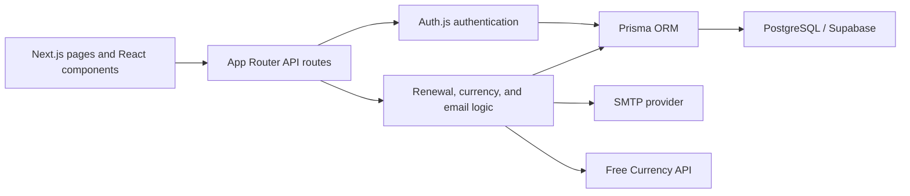

# SubscriptionTrackr 📈

SubscriptionTrackr is a full-stack application for tracking recurring expenses, understanding monthly and annual spending, and keeping upcoming renewal dates in one place.

[Live Demo](https://subsciptiontrackr.vercel.app/) · [MIT License](./LICENSE)

## Screenshots

### Landing page


### Dashboard walkthrough


## Demo credentials

You can explore the hosted application with the demo account below:

```text
Email: kamatsparsh@gmail.com
Password: 11111111
```

This account is public and intended only for portfolio testing. Do not store personal or sensitive information in it, and expect its sample data to change.

## Key features

- Email/password and Google authentication with Auth.js.
- Create, view, update, filter, and delete subscriptions.
- Active, paused, and cancelled subscription states.
- Monthly and annual cost normalization across billing cycles.
- Currency conversion using rates stored in PostgreSQL.
- Upcoming renewal tracking and category spending charts.
- Automatic advancement of overdue renewal dates.
- Responsive light and dark themes.

## Tech stack

- **Framework:** [Next.js 15](https://nextjs.org/) with the App Router
- **Language:** [TypeScript](https://www.typescriptlang.org/)
- **UI:** [React 19](https://react.dev/), [shadcn/ui](https://ui.shadcn.com/), and [Tailwind CSS](https://tailwindcss.com/)
- **Forms:** React Hook Form and Zod
- **Charts:** Recharts
- **Authentication:** Auth.js v5 with credentials and Google OAuth
- **Database:** PostgreSQL hosted on Supabase
- **ORM:** Prisma
- **Email:** Nodemailer over SMTP
- **Deployment:** Vercel

## Local setup

### Prerequisites

- Node.js 20 or newer
- pnpm 10 or newer
- A PostgreSQL database
- SMTP credentials if you want to test registration, verification, and password resets

### 1. Clone and install

```bash
git clone https://github.com/sparsh-kamat/SubscriptionTrackr.git
cd SubscriptionTrackr
pnpm install
```

### 2. Configure environment variables

Create a `.env.local` file in the project root:

```dotenv
# PostgreSQL / Supabase
DATABASE_URL="postgresql://..."
DIRECT_URL="postgresql://..."

# Auth.js
NEXTAUTH_URL="http://localhost:3000"
NEXTAUTH_SECRET="replace-with-a-long-random-secret"

# Google OAuth
GOOGLE_CLIENT_ID=""
GOOGLE_CLIENT_SECRET=""

# SMTP email
EMAIL_SERVER_HOST=""
EMAIL_SERVER_PORT="587"
EMAIL_SERVER_USER=""
EMAIL_SERVER_PASSWORD=""
EMAIL_FROM="SubscriptionTrackr <no-reply@example.com>"

# Currency-rate updates and protected cron endpoint
FREECURRENCYAPI_KEY=""
CRON_SECRET="replace-with-another-random-secret"
```

Google OAuth, outbound email, and exchange-rate updates need their corresponding credentials. The database and Auth.js variables are required for the core application.

### 3. Prepare the database

```bash
pnpm prisma:generate
pnpm exec prisma db push
```

Optionally fetch and store the latest currency rates:

```bash
pnpm db:update-rates
```

### 4. Start development

```bash
pnpm dev
```

Open [http://localhost:3000](http://localhost:3000).

### 5. Verify a production build

```bash
pnpm lint
pnpm build
```

## Architecture summary



- `src/app` contains pages and server-side API routes.
- `src/components` contains the dashboard, subscription forms, and shared UI.
- `src/lib` contains authentication, Prisma, validation, currency, and renewal logic.
- `src/data` contains focused database-access helpers.
- `prisma/schema.prisma` defines users, Auth.js records, subscriptions, verification tokens, and exchange rates.
- `src/scripts/update-rates.ts` powers both manual and scheduled exchange-rate updates.

The browser loads the dashboard through authenticated API routes. Those routes verify the current session, query or update PostgreSQL through Prisma, and return only the current user's subscriptions. External email and exchange-rate services are kept behind server-side modules.

## Billing edge cases

- Monthly and quarterly subscriptions preserve the original billing day where possible.
- A subscription billed on the 29th, 30th, or 31st is clamped to the final valid day of shorter months.
- Annual subscriptions created on February 29 move to February 28 in non-leap years.
- If an active subscription has an old renewal date, the app calculates the first recurrence after the current date and stores it when the subscription is displayed or updated.
- Paused and cancelled subscriptions do not automatically advance while they remain inactive.
- Billing calculations represent expected recurring costs; SubscriptionTrackr does not charge cards or contact subscription providers.

## Known limitations

- Spending comparisons are based on the current active subscriptions because historical snapshots are not stored yet.
- Renewal dates advance when application data is read or updated, rather than through a dedicated background billing engine.
- The app does not currently send renewal reminders or push notifications.
- Currency accuracy depends on the latest successfully stored exchange rates and the external API's availability.
- There is no automatic subscription discovery from bank statements or email receipts.
- Deleting a subscription is permanent after confirmation; there is no undo or archive feature.
- The public demo account is shared, so its data is not private or stable.

## What I learned building it independently

I built SubscriptionTrackr independently as a portfolio project to understand how the pieces of a real full-stack product fit together, rather than treating the frontend, authentication, and database as separate exercises.

The project taught me how to model relational data with Prisma, protect user-owned records in API routes, implement credentials and OAuth authentication, validate forms on both the client and server, normalize costs across different billing cycles and currencies, and deploy a database-backed Next.js application to Vercel.

The most useful lesson was that product work continues after the main feature works. Date edge cases, edit-form state, safe logging, email flows, dependency maintenance, error handling, and honest dashboard metrics all matter when turning a working prototype into something I am comfortable sharing publicly.

## License

SubscriptionTrackr is available under the [MIT License](./LICENSE).
